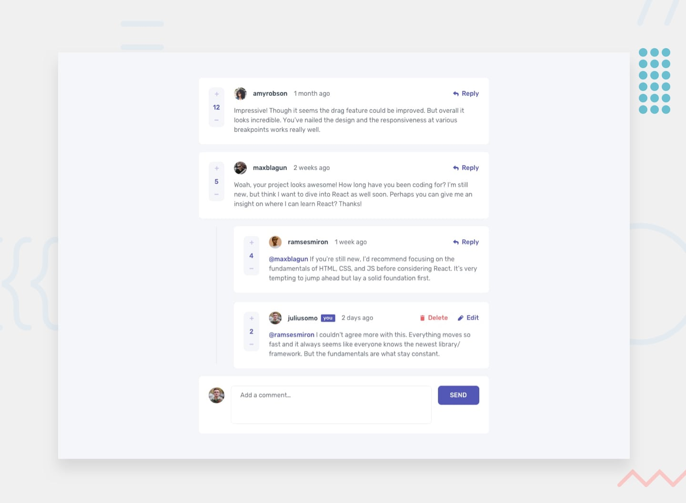

# Comentários Interativos

Nesse projeto irei desenvolver uma seção de comentários interativos, onde será possível realizar um comentário caso queira alterar e deletar ele também será possível.

## Menu

- [O Projeto](#o-projeto)
- [O que aprendi](#o-que-aprendi)
- [Screenshot](#screenshot)
- [Construido com](#construido-com)
- [Link](#link)
- [Contatos](#contatos)

### O que aprendi

O desenvolvimento desse projeto irá me ajudar a aprender mais sobre o CRUD (Create, Read, Update, Delete) que será de muita importância para desenvolvimento de projetos futuros.

### Screenshot

### Construido com

As tecnologias utilizadas para esse projeto são as listadas abaixo:

- Semantic HTML5 markup
- CSS custom properties
- JavaScript

### Link

### Contatos

[LinkedIn](https://www.linkedin.com/in/lucas-boarini)